## Hello, I'm Njogu Amos, a web developer 👋

I'm a full-stack developer based in Nairobi, Kenya.

I have eight years of experience developing secure, functional, well-tested, accessible, user-friendly, and maintainable web applications. I focus on building scalable and user-friendly applications. I am motivated by new challenges and enjoy helping others solve their problems.

Whether I am working independently or as part of a team, I always pay attention to detail, deliver outstanding results, and keep all stakeholders informed. I enjoy using the Laravel PHP framework to develop full-stack applications and designing creative graphics.

Do you have a project or an idea? Let's talk.

Here is [link to my portfolio](https://njoguamos.me.ke)

---

### Languages and Tools

  

 

---

